### 射击战场

使用 UE4 引擎制作的第三人称射击游戏

### 玩法简介

* 第三人称射击游戏

  玩家可进行移动, 瞄准, 射击

  可以拾取和切换不同的枪械

* 敌人为 AI 控制的角色

  不同的敌人会有不同的行为和特性

  敌人和玩家均有血量设定, 受到攻击后血量减少, 玩家血量小于 0 后游戏失败, 敌人血量小于 0 后被击败

* 击败关卡中所有敌人为通关

  关卡中会随机刷新 buff, 玩家拾取获得血量/子弹增益

### 演示视频

[百度网盘链接](https://pan.baidu.com/s/1kiO8kcv9kTPs5-ktjfXpMw), 提取码: yspm

### 技术要点

* [人物动画](#head1)
* [物品拾取](#head2)
* [枪械与近战武器的实现](#head3)
* [敌人AI](#head4)

### 遇到的问题与解决方法

* [射不准问题](#head1)
* [逃离问题](#head2)

### 参考资料

[Unreal Engine 4 Documentation](https://docs.unrealengine.com/4.27/en-US/ )

[Shooter Game](https://docs.unrealengine.com/4.27/en-US/Resources/SampleGames/ShooterGame/)

[Advanced Locomotion System V4](https://www.unrealengine.com/marketplace/en-US/product/advanced-locomotion-system-v1)

* ## 人物动画

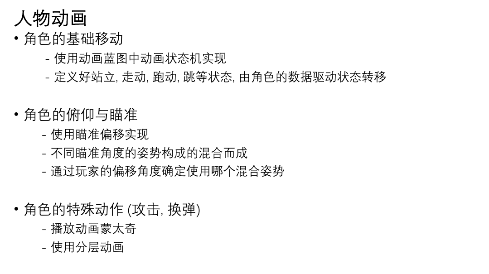

* ## 物品拾取

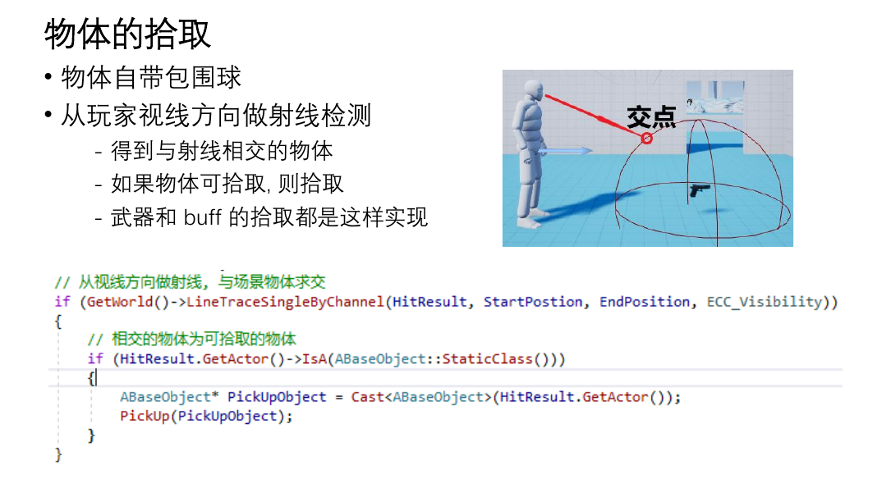

* ## 枪械与近战武器的实现

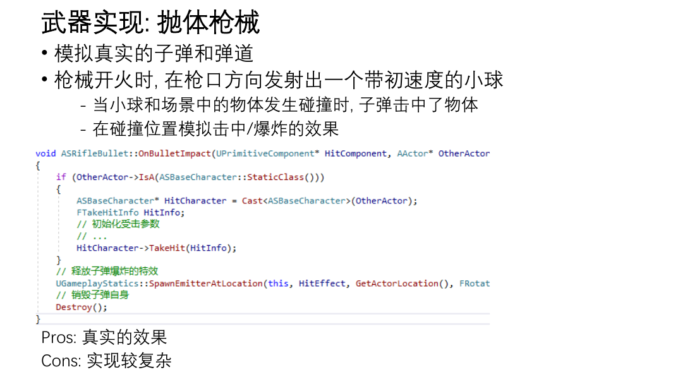

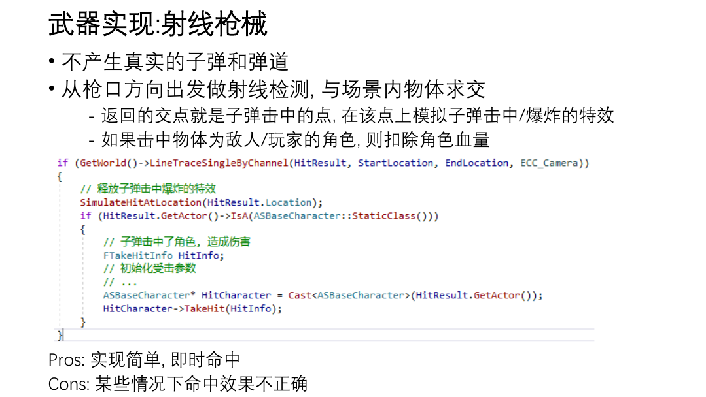

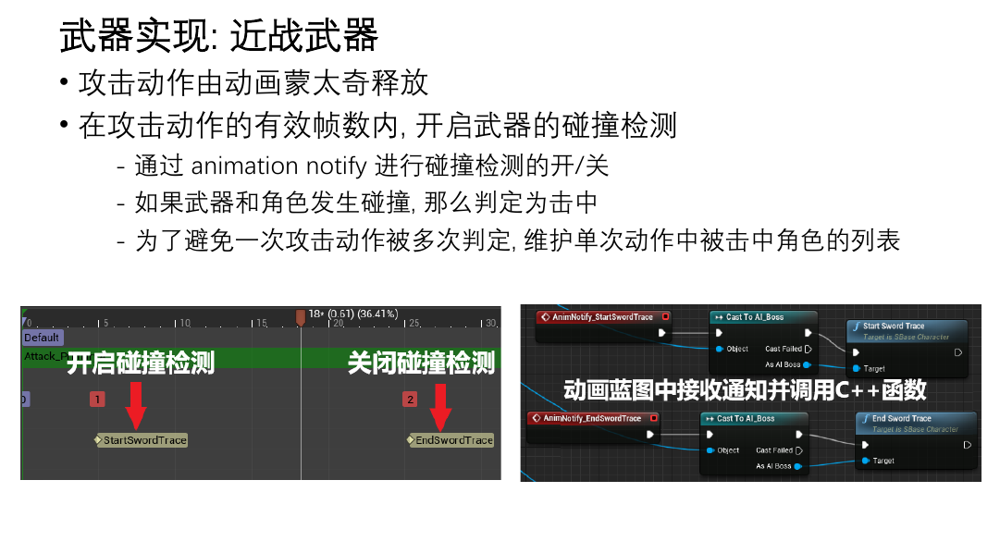

* ## 敌人AI

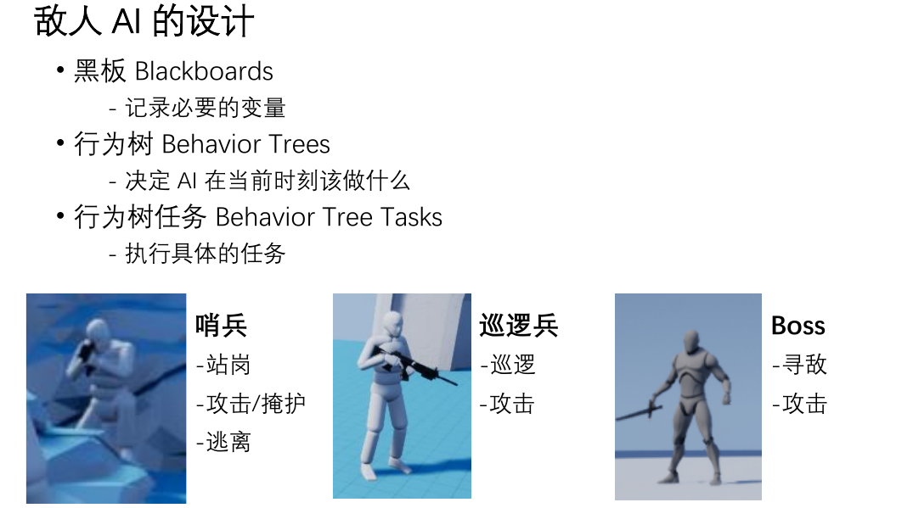

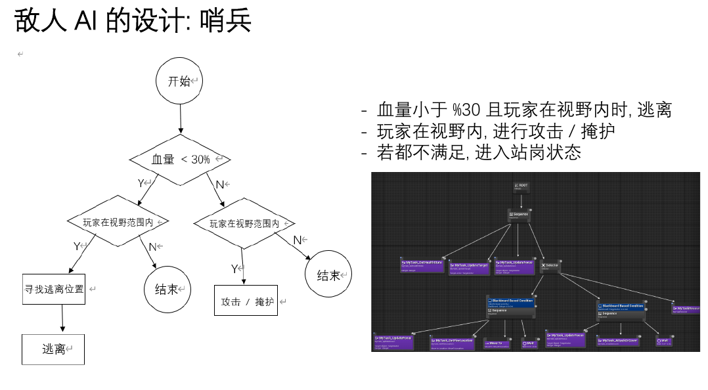

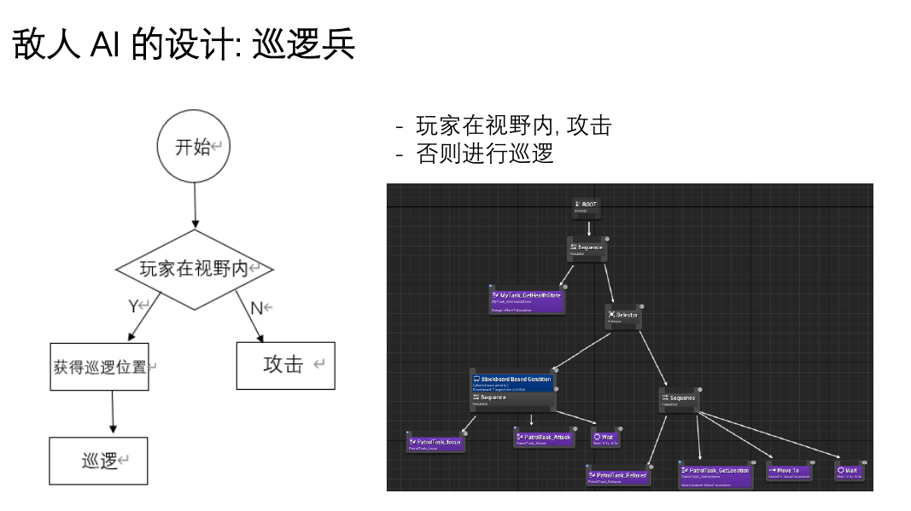

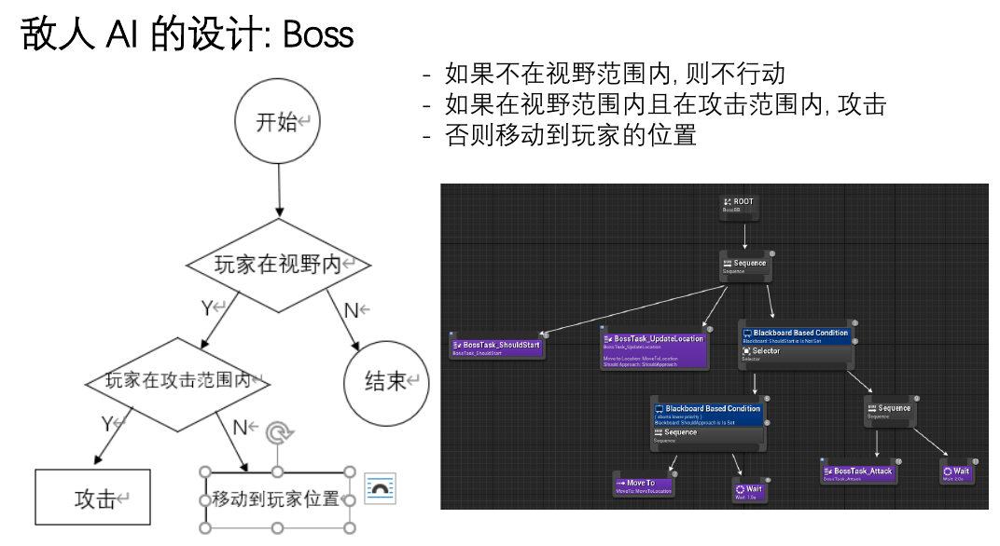

* ## 射不准问题

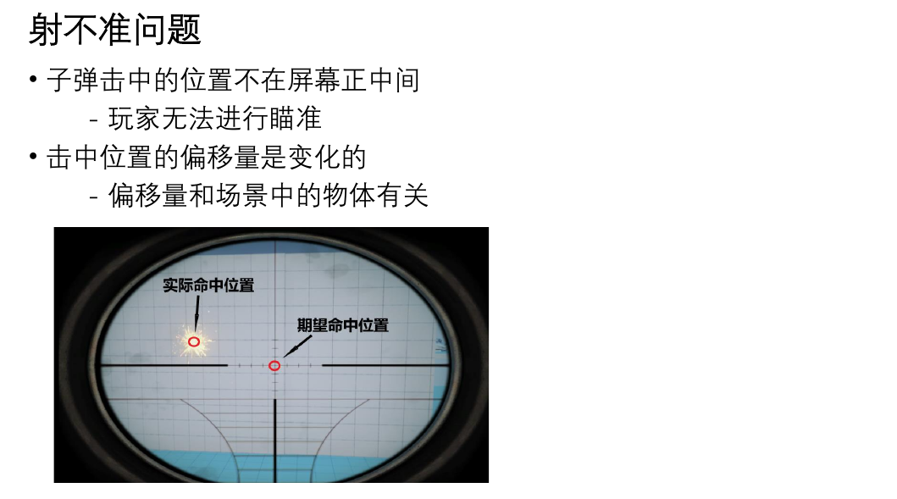

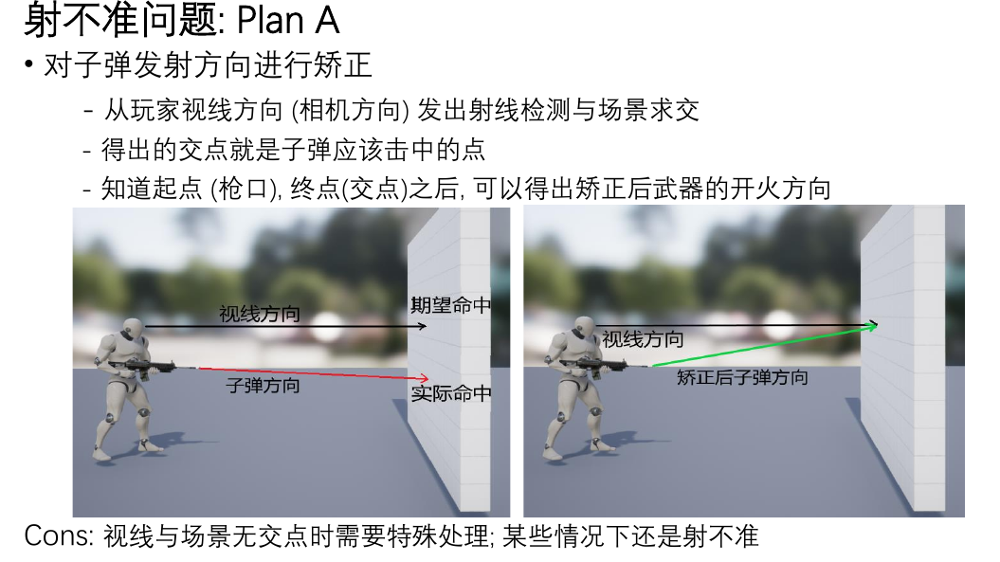

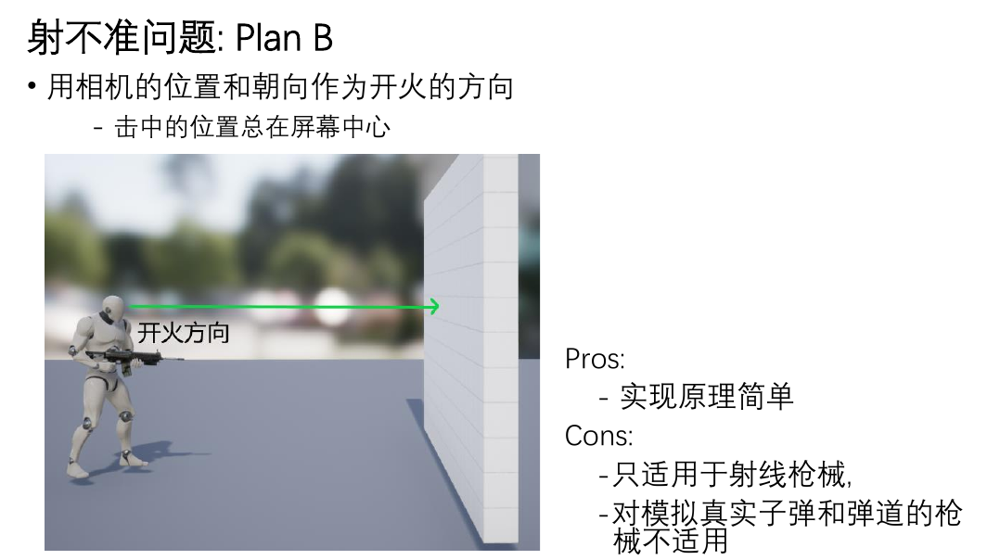

* ## 逃离问题

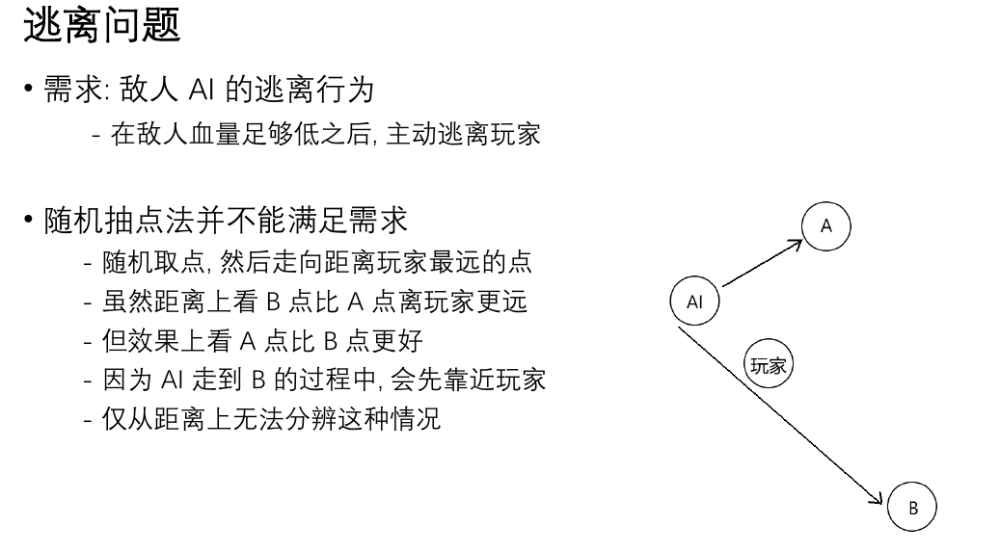

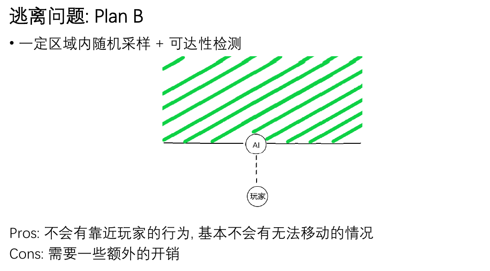
